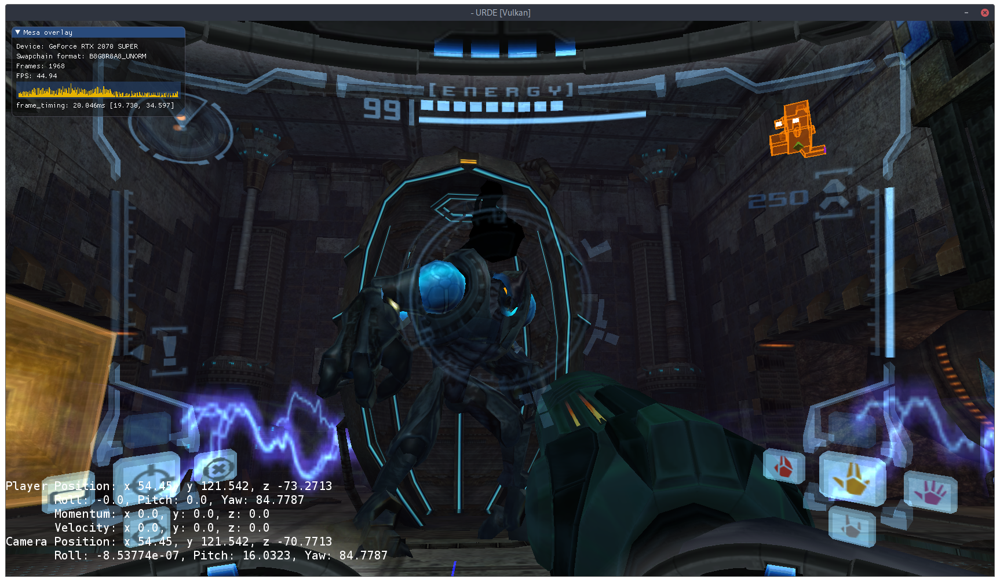

## URDE
**Status:** Metroid Prime 1 In-Game (all retail GC & Wii versions)

**Official Discord Channel:** https://discord.gg/AMBVFuf



### Download
Precompiled builds of the command-line extraction utility (`hecl`) with embedded dataspec libraries are available at https://releases.axiodl.com. This will give you intermediate dumps of original formats as *blender* and *yaml* representations.

Everything else is much too experimental to make portable/stable release builds (for now)

### Platform Support
* Windows 10 (64-bit, D3D11 / Vulkan)
* macOS 10.15+ (Metal)
* Linux (Vulkan)
    * Follow [this guide](https://github.com/lutris/docs/blob/master/InstallingDrivers.md) to set up Vulkan & appropriate drivers for your distro.
    
### Usage (GC versions)

* Extract ISO: `hecl extract [path].iso -o mp1`
  * `mp1` can be substituted with the directory name of your choice
* Repackage game for URDE: `cd mp1; hecl package`
* Run URDE: `urde mp1/out`

### Usage (Wii versions)

NFS files dumped from Metroid Prime Trilogy on Wii U VC can be used directly without converting to ISO.

* Extract ISO or NFS: `hecl extract [path].[iso/nfs] -o mpt`
  * `mpt` can be substituted with the directory name of your choice
* Repackage game for URDE: `cd mpt; hecl package MP1`
  * The `MP1` parameter is important here.
* Run URDE: `urde mpt/out`

#### URDE options (non-exhaustive)

* `-l`: Enable console logging
* `--warp [worldid] [areaid]`: Warp to a specific world/area. Example: `--warp 2 2`
* `+developer=1`: Enable developer console

### Build Prerequisites:
* [CMake 3.13+](https://cmake.org)
    * Windows: Install `CMake Tools` in Visual Studio
    * macOS: `brew install cmake`
* [Python 3+](https://python.org)
    * Windows: [Microsoft Store](https://go.microsoft.com/fwlink?linkID=2082640)
        * Verify it's added to `%PATH%` by typing `python` in `cmd`.
    * macOS: `brew install python@3`
* LLVM development package *(headers and libs)*
    * [Specialized Windows Package](https://axiodl.com/files/LLVM-10.0.1-win64.exe)
    * macOS: `brew install --force-bottle llvm`
* **[Windows]** [Visual Studio 2019 Community](https://www.visualstudio.com/en-us/products/visual-studio-community-vs.aspx)
    * Select `C++ Development` and verify the following packages are included:
        * `Windows 10 SDK`
        * `CMake Tools`
        * `C++ Clang Compiler`
        * `C++ Clang-cl`
* **[macOS]** [Xcode 11.5+](https://developer.apple.com/xcode/download/)
* **[Linux]** recent development packages of `udev`, `x11`, `xcb`, `xinput`, `glx`, `asound`
    * Ubuntu 20.04+ packages
      ```
      build-essential curl git ninja-build llvm-dev libclang-dev clang lld zlib1g-dev
      libglu1-mesa-dev libdbus-1-dev libvulkan-dev libxi-dev libxrandr-dev libasound2-dev libpulse-dev
      libudev-dev libpng-dev libncurses5-dev cmake libx11-xcb-dev python3 python-is-python3 qt5-default
      ```

### Prep Directions

```sh
git clone --recursive https://github.com/AxioDL/urde.git
mkdir urde-build
cd urde-build
```

### Update Directions

```sh
cd urde
git pull
git submodule update --recursive
```

### Build Directions

For Windows, it's recommended to use Visual Studio. See below.

#### ninja (Windows/macOS/Linux)

```sh
cd urde-build
cmake -DCMAKE_BUILD_TYPE=Debug -G Ninja ../urde
ninja
```

#### CMake options
- Build release optimized (better runtime performance): `-DCMAKE_BUILD_TYPE=Release`
- Use clang+lld (faster linking): `-DCMAKE_C_COMPILER=clang -DCMAKE_CXX_COMPILER=clang++`
- Optimize for current CPU (resulting binaries are not portable): `-DURDE_VECTOR_ISA=native`

#### CLion (Windows/macOS/Linux)
*(main development / debugging IDE)*

Open the repository's `CMakeLists.txt`.

Optionally configure CMake options via `File` > `Settings` > `Build, Execution, Deployment` > `CMake`.

#### Qt Creator (Windows/macOS/Linux)

Open the repository's `CMakeLists.txt` via File > Open File or Project.

Configure the desired CMake targets to build in the *Projects* area of the IDE.

#### Visual Studio (Windows)

Verify all required VS packages are installed from the above **Build Prerequisites** section.

Open the `urde` directory in Visual Studio (imports CMake configuration).

MSVC and clang-cl configurations should import automatically.

#### Xcode (macOS)

```sh
cmake -G Xcode ../urde
```

Then open `urde.xcodeproj`

#### Optional Debug Models
We provide custom debug models for use to visualize certain aspects of the game such as lighting, in order to use 
these models you may download them from https://axiodl.com/files/debug_models.zip and extract to `MP1/URDE` in an 
existing HECL project (assuming paths are relative), then run the the following command:

```sh
hecl package MP1/URDE
```
This will cook and package the debug models and will automatically enable rendering of lights in a debug build of URDE.
